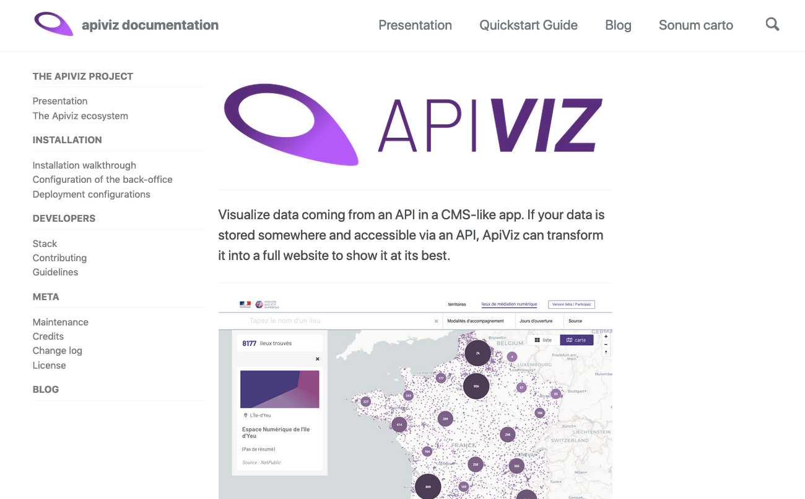

## FRONTEND


-------
## PRESENTATION

Visualize data coming from an API in a CMS-like app : in short we aim to develop a Wordpress for data-visualisation. 

If your data is stored somewhere and accessible via an API, ApiViz can transform it into a full website to show it at its best. 

ApiViz includes "out-the-box" a back-office to fully configure/customize an original datavisualisation website 

--------

#### WARNINGS : 

**apiviz-frontend** is only the frontend of the APIVIZ application, it only works if (and only) if A **[apiviz-backend](https://github.com/co-demos/apiviz-backend)** is correctly installed first or is serving configurations to the frontend.

To fully enjoy Apiviz frontend's features if you're not using Solidata's API ***your own API*** might propose all or some of the following parameters, or equivalent : 

- `item_id` : search an item by its id
- `page_number` : the page number
- `results_per_page` : the number of items per page
- `sort_by` : field to sort your result by
- `sort_order` : sorting order
- `query` : full text searrch
- `shuffle_seed` (optionnal) : if you want to shuffle the results
- `results_for_map` : getting all the results in a condensed format, like `{ id : <item_id>, lat: <latittude>, lng: <longitude>}`
- `search_filter` : to filter out your results given a field name and a value. For instance querying all items in a 'my-data' dataset in which the field 'category' has the value 'categ01' could be similar to : `https://my-api.com/my-data?search_filter=category__categ01`

--------

#### DEPLOYED WEBSITES : 

Main apiviz demo website : 
- [Apiviz.io](https://apiviz.io) : [](https://app.netlify.com/sites/apiviz-demo-site/deploys)

Main Apiviz instances with public data : 
- [tiers-lieux (test)](https://tiers-lieux-dataviz.netlify.com/recherche/carte) : [](https://app.netlify.com/sites/tiers-lieux-dataviz/deploys)
- [sonum-preprod](https://apiviz-preprod-sonum.netlify.com/sonum-carto/carte) : [](https://app.netlify.com/sites/apiviz-preprod-sonum/deploys)
- [apcis-preprod](https://apiviz-preprod-cis.netlify.com/recherche/carte) : [](https://app.netlify.com/sites/apiviz-preprod-cis/deploys)
- [apcis-preprod (CIS migration )](https://carrefour-innovations-sociales.fr/recherche) : [](https://app.netlify.com/sites/apiviz-preprod-apcis-url-migration/deploys)
- [PiNG-carto](https://ping-carto.netlify.com) : [](https://app.netlify.com/sites/ping-carto/deploys)
- [Codes Etalab](https://etalab-codes.netlify.com/) : [](https://app.netlify.com/sites/etalab-codes/deploys)
- [Inventaire des orgues](https://orgues-apiviz.netlify.com/) : [](https://app.netlify.com/sites/orgues-apiviz/deploys)


Test websites : 
- [OpenCorporateFacts - calendar branch](https://https://opencorporatefacts-branch-calendar.netlify.com) : [](https://app.netlify.com/sites/opencorporatefacts-branch-calendar/deploys)
- [OpenCorporateFacts - develop branch](https://https://opencorporatefacts.netlify.com) : [](https://app.netlify.com/sites/opencorporatefacts/deploys)


--------

## DOCUMENTATION 

Check out our brand new Apiviz presentation website : https://apiviz.io

Check out our brand new documentation website on Github pages : https://co-demos.github.io/apiviz-frontend/

[](https://co-demos.github.io/apiviz-frontend/)
<!-- -------- -->

<!--  -->

--------

## THE APIVIZ ECOSYSTEM

ApiViz is designed to **agnosticaly display data** and provide an engine to deploy a **datavisualisation website** without (too much) pain, not regarding to the service(s) serving and storing the data. 

Nevertheless to do so an instance of ApiViz must be connected to several external services : one for authentication, one for serving the data, one for storing the static contents (html pages, images...).

The goal of ApiViz is to **work with any external service** fulfilling those roles, but we developed an **eco-system of open source applications** allowing a complete and free way to deploy such a datavisualisation service. 

<br>

| logo | the open source eco-system ( aka TADATA! ) |
|    :----:   |          :--- |
|  | **[Apiviz](https://github.com/co-demos/ApiViz)** as the high-level app for visualisation, a sort of open source CMS for data-visualisation ;   |
|  | **[Solidata](https://github.com/entrepreneur-interet-general/solidata_frontend)** to "API-fy" your data and manage open data projects ; |
|  | **[TokTok](https://github.com/co-demos/toktok)** for a dedicated authentication service to manage users, JWT, and roles.  |
|  | **[OpenScraper](https://github.com/entrepreneur-interet-general/OpenScraper)** is a generic web scraper serving the results of the scraping via its API  |


--------

## DEVELOPERS

Please check out our *[guidelines](./GUIDELINES_DEV.md)*

You can also check the *[development roadmap for future features](https://github.com/co-demos/apiviz-frontend/projects/1)*

--------

## INSTALLATION WALKTHROUGH 

--------

Before anything if you want to use the whole stack as a stand-alone app you need to install **[Apiviz-backend](https://github.com/co-demos/apiviz-backend)** to serve your configuration to the frontend.

Otherwise you just need to add a `.env` file at the root with the following content : 

```env

APIVIZ_REPO=/apiviz-frontend/
DEPLOY_ENV=NETLIFY

### uses Apiviz backend's preprod server
NUXT_BACKEND_MODE=preprod

### uses Apiviz's distant preprod auth server
NUXT_AUTH_MODE=distant_preprod

### you can comment / de-comment the pair of you choice 
### so you'll get the corresponding instance's specific configuration

NUXT_APP_CONFIG_NAME=DEMO_APIVIZ
NUXT_APIVIZ_UUID=89edbf7d-8b63-4088-ad14-ae6779d7698f

# NUXT_APP_CONFIG_NAME=SONUM
# NUXT_APIVIZ_UUID=c5efafab-1733-4ad1-9eb8-d529bc87c481

# NUXT_APP_CONFIG_NAME=APCIS
# NUXT_APIVIZ_UUID=f0a482da-28be-4929-a443-f22ecb03ee68

# NUXT_APP_CONFIG_NAME=TIERS_LIEUX
# NUXT_APIVIZ_UUID=fd9d4302-bddb-4fb1-8f13-d64dfdb66b91

# NUXT_APP_CONFIG_NAME=PING_CARTO
# NUXT_APIVIZ_UUID=0278419c-558e-43d5-a4d6-c836afd10445

# NUXT_APP_CONFIG_NAME=CONNUMM
# NUXT_APIVIZ_UUID=2f658fb8-f00a-4b1a-ab73-7064433c98bc

# NUXT_APP_CONFIG_NAME=ETALAB_CODES
# NUXT_APIVIZ_UUID=a44de08d-12a1-4182-a06e-78058928c1e1

# NUXT_APP_CONFIG_NAME=ASSO_ORGUES
# NUXT_APIVIZ_UUID=3f3fd562-5202-427f-8ba3-f58d5660aabf

# NUXT_APP_CONFIG_NAME=OPEN_CORPORATE_FACTS
# NUXT_APIVIZ_UUID=305ab50d-c976-44d7-a8f2-a7594155c292

```

## Build setup (with Nuxt)

``` bash
# install dependencies
$ npm install

# serve with hot reload at localhost:3000
# get env vars from .env file
$ npm run dev
```

You can also use those other commands
``` bash
# overwrites .env file with env vars from script in package.json
$ npm run dev-test

# get env vars from .env file but overwrites NUXT_BACKEND_MODE as local backend served with Docker
$ npm run dev-docker

# build for production and launch server
$ npm run build
$ npm start

# generate static project
$ npm run generate
```

... then check in your browser : [`localhost:3001`](localhost:3001) (see the `nuxt.config.js` file to know more)

## Build setup (with Docker)

``` bash
# install / stop / restart

$ make up # run app with Docker
$ make restart # restart app with Docker
$ make down # stop app with Docker
```

... then check in your browser : [`localhost:3333`](localhost:3333)
