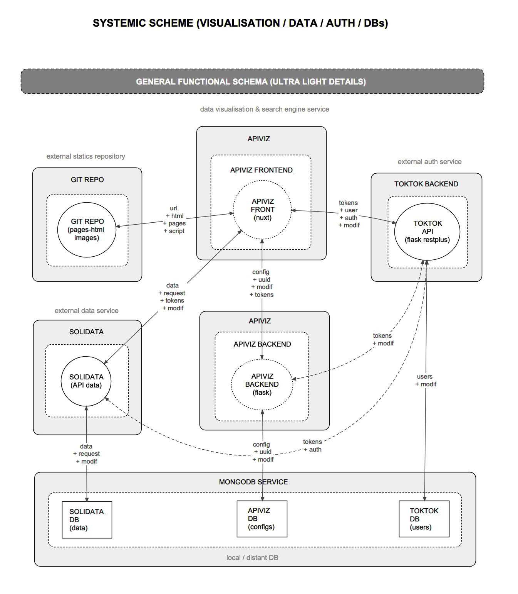

--------

## THE APIVIZ ECOSYSTEM

ApiViz is designed to **agnosticaly display data** and provide an engine to deploy a **datavisualisation website** without (too much) pain, not regarding to the service(s) serving and storing the data. 

Nevertheless to do so an instance of ApiViz must be connected to several external services : one for authentication, one for serving the data, one for storing the static contents (html pages, images...).

The goal of ApiViz is to **work with any external service** fulfilling those roles, but we developed an **eco-system of open source applications** allowing a complete and free way to deploy such a datavisualisation service. 

 

| logo | the open source eco-system ( aka TADATA! ) |
|    :----:   |          :--- |
|  | **[Apiviz](https://github.com/co-demos/ApiViz)** as the high-level app for visualisation, a sort of open source CMS for data-visualisation ;   |
|  | **[Solidata](https://github.com/entrepreneur-interet-general/solidata_frontend)** to "API-fy" your data and manage open data projects ; |
|  | **[TokTok](https://github.com/co-demos/toktok)** for a dedicated authentication service to manage users, JWT, and roles.  |
|  | **[OpenScraper](https://github.com/entrepreneur-interet-general/OpenScraper)** is a generic web scraper serving the results of the scraping via its API  |

 

In the following illustration you can have a general idea of how those several services could work altogether. Check the [`/documentation/configurations`](../documentation/configurations) folder to have a broader look to [other configurations](../documentation/configurations/APIVIZ_CONFIGURATIONS-export.pdf).

You can also check those several projects and repository to find some layout for your specific new datavisualisation website : 
- Sonum repo ;
- CIS repo ;
- ... and more to come... 

**Note** : all the schemas were realized with [VUE - Visual Understanding Environment](https://vue.tufts.edu/index.cfm), an open source mind mapping tool. The source file for the schemas is [here](../documentation/configurations/APIVIZ_CONFIGURATIONS.vue)
