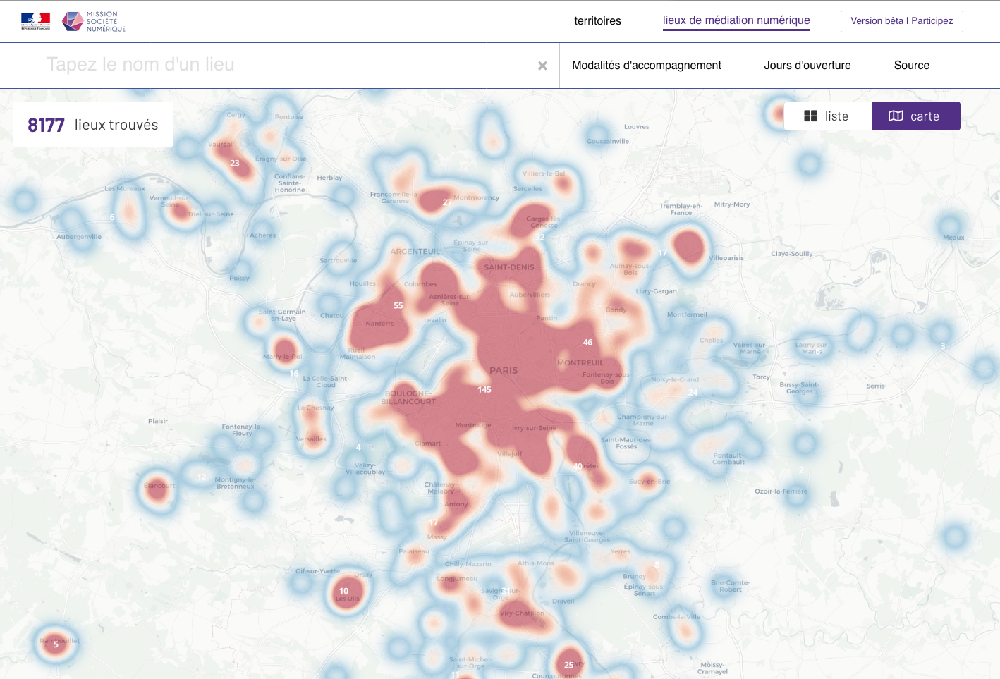

-----

Visualize data coming from an API in a CMS-like app. 
If your data is stored somewhere and accessible via an API, ApiViz can transform it into a full website to show it at its best. 

---------

ApiViz includes "out-the-box" a back-office to fully configure an original datavisualisation website : 
  - **navbar** : define the logo, links, and menus in your apiviz instance's navabr. 
  - **styles** : define the CSS styles for your apiviz instance.
  - **routes** : define the pages and routes of your apiviz instance, either statics contents or data views.
  - **data endpoints** : define the data endpoints feeding your apiviz instance and the fields you want to display.
  - **global** : define some metadata for your apiviz instance.
  - **footer** : define the links present in the apiviz instance's footer.

-----

--------

#### WARNING : 

**apiviz-frontend** is only the frontend of the APIVIZ application, it only works if and only if the **[apiviz-backend](https://github.com/co-demos/apiviz-backend)** is correctly installed first.

------------

## SCREENSHOTS (development)

------------

#### MAP VIEW (Sonum client configuration)
displays your geolocalized data, given your configuration set in backoffice

------------

#### HEATMAP VIEW (Sonum client configuration)
in development : geographical densities of points

------------

#### LIST VIEW (APCIS client configuration)
displays your data as a cards list, given your configuration set in backoffice

------------

#### DETAIL VIEW (Sonum client configation)
displays your data as a detailed pages, given your configuration set in backoffice

------------

#### ADMIN / BACKOFFICE (in development)

